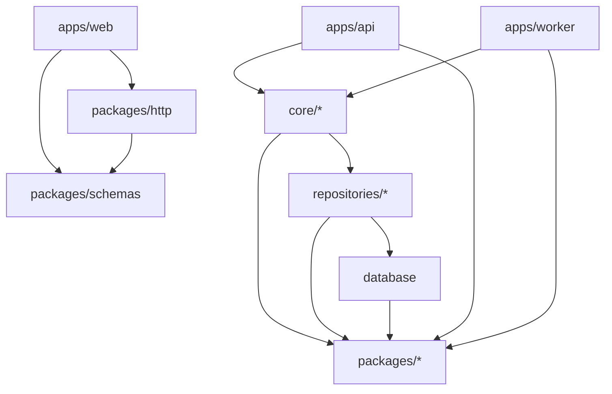

# Dependency hierarchy (the rule the scaffolding protects)

Allowed direction: **apps → core → repositories → database**, and **everything → packages**. Never the reverse. `packages/*` are leaves — they import nothing internal (except `http → schemas`).

```
apps/web ─────────► packages/{schemas,http}      (FE ↔ contract only)
apps/{api,worker} ─► core/* ─► repositories/* ─► database/
                              │       │
                              ▼       ▼
                          packages/{schemas,ai,queue,storage,config,http,observability}
                          (everything → packages, packages → nothing internal)
```



**Frontend lockdown (most important rule):** Frontend (`apps/web`) is constrained to consume **only** `@lexiai/schemas` and `@lexiai/http`. It never imports `core/`, `database/`, `repositories/`, or backend-only packages (`ai`, `queue`, `storage`). This is the single most important rule the scaffolding must protect.

**Enforcement:** Biome `style/noRestrictedImports` per-glob overrides (`biome.json`) fail lint on a forbidden import. (Pre-F-PLAT-002 the per-package `tsconfig.json` `references` also constrained edges under `tsc -b`; F-PLAT-002 removed those references in favour of a source-resolution typecheck — see `@.claude/rules/tooling.md` — so the layer rule is now enforced by Biome alone.) Run `/scan-deps` to check.
