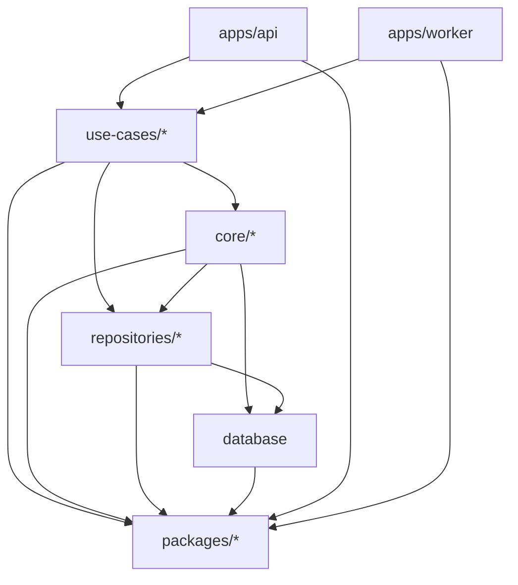

# Dependency hierarchy (the rule the scaffolding protects)

Allowed direction: **apps → use-cases → core → repositories → database**, and **everything → packages**. Never the reverse. `packages/*` are leaves — they import nothing internal. **`use-cases/`** is the top application tier below `apps/*`: the user-flow composer **functions** (`requestWordBuild`, `buildWord`) that aggregate `core/*` functions + the repo functions into one end-to-end flow an app binds — it may import core/repositories/database/packages, never apps, and nothing below may import upward into it. **`database/` is the bottom of the chain and the author of the word vocabulary** (the content effect-schemas, value tuples/pgEnums, and the `WordEntity` row schema); `use-cases/`, `core/` and `apps/*` consume those shapes directly (rows flow through services; contracts compose the entities; core's read models derive their leaves from them) — `use-cases → database`, `core → database` and `apps → database` are legal downward edges — so the word shapes are single-authored without a cycle.

```
apps/{api,worker} ─► use-cases/* ─► core/* ─► repositories/* ─► database/   (database authors vocabulary + WordEntity)
                                      │  ▲ use-cases/core/apps consume WordEntity/WordRow directly
                                      ▼
                                  packages/{ai,queue,storage,config,observability}
                                  (everything → packages, packages → nothing internal)
```



**Frontend lockdown (most important rule):** Frontend (`apps/web`) must **not** import any internal `@lexiai/*` package — not `core/`, `database/`, `repositories/`, the backend-only packages (`ai`, `queue`, `storage`), nor a vocabulary package (there is none — `packages/schemas` was deprecated). The HTTP contract lives with its server (`apps/api/src/words/words.api.ts`); the FE's domain/contract surface is re-established when the first web feature lands. This is the single most important rule the scaffolding must protect.

**Enforcement:** Biome `style/noRestrictedImports` per-glob overrides (`biome.json`) fail lint on a forbidden import. (Pre-F-PLAT-002 the per-package `tsconfig.json` `references` also constrained edges under `tsc -b`; F-PLAT-002 removed those references in favour of a source-resolution typecheck — see `.claude/rules/tooling.md` — so the layer rule is now enforced by Biome alone.) Run `/scan-deps` to check.
