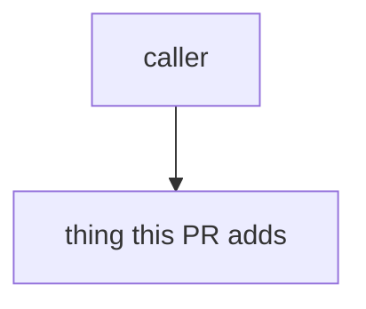

<!--
  ┌─────────────────────────────────────────────────────────────────────────┐
  │  HOW TO USE THIS TEMPLATE — everything in THIS comment is review-only and │
  │  is STRIPPED from the squashed commit. Text OUTSIDE comments survives.    │
  ├─────────────────────────────────────────────────────────────────────────┤
  │  This repo squash-merges with "Pull request title and description", so:   │
  │    • PR TITLE       -> commit SUBJECT                                      │
  │    • PR DESCRIPTION -> commit BODY  (everything below, comments stripped)  │
  │                                                                            │
  │  TITLE the PR as a commits.md subject line:                               │
  │    <gitmoji> <type>(<scope>): <subject>                                    │
  │    imperative · Capitalised · ≤50 chars · no trailing period              │
  │    e.g.  :sparkles: feat(F-PLAT-001/T05): Scaffold shared packages        │
  │  GitHub pre-fills the squash subject box from this title.                 │
  │  Format owned by .claude/rules/commits.md — see .claude/rules/pull-requests.md.
  │                                                                            │
  │  ── Author self-check (tick before requesting review) ──                  │
  │  [ ] Title is a commits.md subject (gitmoji + type(scope) + imperative ≤50)│
  │  [ ] `bun run check` passes (Biome lint + `bun run tsc`)                   │
  │  [ ] `bun run test` passes                                                 │
  │  [ ] Dependency hierarchy intact (apps -> core -> repositories -> database)│
  │  [ ] Frontend (apps/web) imports only @lexiai/schemas + @lexiai/http       │
  │  [ ] No imports from repos/ in application code                            │
  │  [ ] Docs/rules updated if behaviour or conventions changed                │
  │                                                                            │
  │  ── How to test ──                                                         │
  │  Steps a reviewer runs locally to verify the change.                      │
  │                                                                            │
  │  ── Screenshots / notes for reviewers ──                                  │
  │  UI diffs, scratch context — useful for review, noise in git history.     │
  └─────────────────────────────────────────────────────────────────────────┘
-->

## Summary

WHAT this PR changes and WHY, in 2–3 sentences wrapped ~72 chars.
Understandable on its own — not a restatement of the task title.

## What changed

- Tight bullets of the notable changes.
- One line each; the diff carries the detail.

## How it works

Short note on the mechanism. Keep a diagram only if it earns its place.

Architecture / flow diagram (optional)

## Decisions

Decision: One paragraph per non-obvious choice — a trade-off made, an
alternative rejected, or a downstream implication. This is the highest-
value section for the next developer and the next AI agent reading
`git log`. Add more `Decision:` paragraphs as needed; drop the section
only if the change is genuinely trivial/mechanical.

## Refs

Refs: https://www.notion.so/<sub-task-url>
Closes #<issue>
