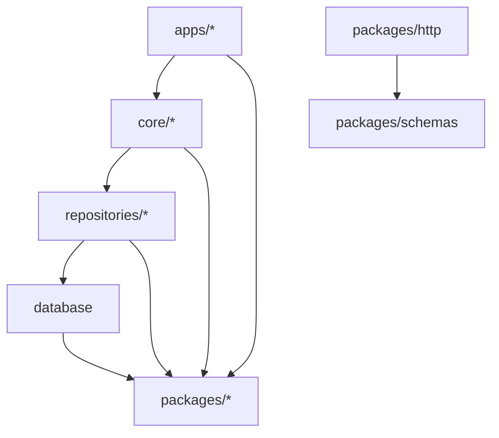

# PR template — worked example

This is a **reference**, not a template GitHub offers on PR creation (only
`PULL_REQUEST_TEMPLATE.md` is). It shows a fully filled PR for a real task
(T05, "Scaffold packages/\* shared workspaces") and the exact commit it
squash-merges into. Use it to see the shape end-to-end. Source of truth for
the format stays `.claude/rules/commits.md`.

---

## 1. The PR title (becomes the squash commit subject)

```
:sparkles: feat(F-PLAT-001/T05): Scaffold shared packages
```

## 2. The PR description (pasted into the description box, template filled)

````markdown
<!--
  Review-only — stripped from the squashed commit.
  TITLE = commits.md subject: <gitmoji> <type>(<scope>): <subject> (≤50, imperative).

  Author self-check:
  [x] Title is a commits.md subject line
  [x] `bun run check` passes (Biome lint + bun run tsc)
  [x] `bun run test` passes
  [x] Dependency hierarchy intact; packages/* import nothing internal (except http -> schemas)
  [x] No imports from repos/ in application code
  [x] Docs/rules updated if needed

  How to test:
    bun install && bun run check && bun run test

  Screenshots / notes:
    n/a — scaffolding only, no runtime behaviour yet.
-->

## Summary

Scaffold the seven shared `packages/*` workspaces (schemas, http, ai,
queue, storage, config, observability) as the leaf layer every other
workspace may depend on. No behaviour yet — each ships a typed stub,
`package.json`, `tsconfig`, and a smoke test so the layer graph compiles.

## What changed

- Added `packages/{schemas,http,ai,queue,storage,config,observability}`.
- Wired catalog versions + `@kotodama/*` names per `.claude/rules/naming.md`.
- `packages/http` references `@kotodama/schemas`; all others are leaves.

## How it works

`packages/*` sit at the bottom of the hierarchy: everything may import
them, they import nothing internal — the one exception is `http -> schemas`.

<details><summary>Where packages/* sit in the layer graph</summary>



</details>

## Decisions

Decision: Each package ships a smoke test from the start rather than
deferring tests to a later task — it forces the `@effect/vitest` project
wiring to be exercised per workspace now, so a broken project reference
fails immediately instead of silently at the first real test.

## Refs

Refs: https://www.notion.so/<T05-sub-task-url>
Closes #5
````

## 3. The squashed commit it produces

After GitHub strips the HTML comment, the commit on `main` is:

**Subject** (from the PR title):

```
:sparkles: feat(F-PLAT-001/T05): Scaffold shared packages
```

**Body** (from the PR description, comment gone):

```
## Summary

Scaffold the seven shared packages/* workspaces (schemas, http, ai,
queue, storage, config, observability) as the leaf layer every other
workspace may depend on. No behaviour yet — each ships a typed stub,
package.json, tsconfig, and a smoke test so the layer graph compiles.

## What changed
- Added packages/{schemas,http,ai,queue,storage,config,observability}.
- Wired catalog versions + @kotodama/* names per naming.md.
- packages/http references @kotodama/schemas; all others are leaves.

## How it works
packages/* sit at the bottom of the hierarchy: everything may import
them, they import nothing internal — the one exception is http -> schemas.

<details><summary>Where packages/* sit in the layer graph</summary>
  …mermaid block renders on the commit page; raw git log shows it folded…
</details>

## Decisions
Decision: Each package ships a smoke test from the start rather than
deferring tests to a later task — it forces the @effect/vitest project
wiring to be exercised per workspace now, so a broken project reference
fails immediately instead of silently at the first real test.

## Refs
Refs: https://www.notion.so/<T05-sub-task-url>
Closes #5
```

The checklist, *How to test*, and reviewer notes lived in the HTML comment
and left no trace — but the Summary, Decisions, and the diagram survive, so
a future `git log -p` reconstructs WHAT + WHY without re-reading Notion.
